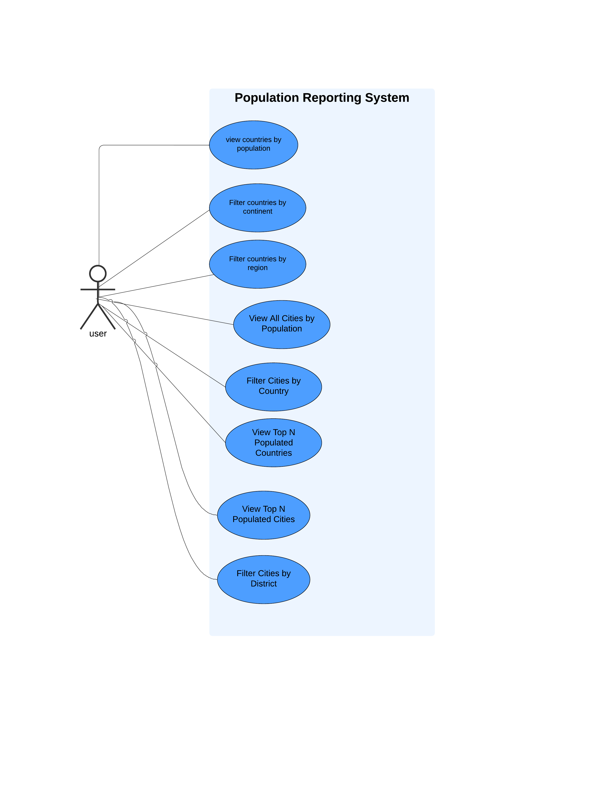

# Population-Report-System
A web application for reporting world population statistics. The application provides various reports about countries and cities based on population data, using an SQL database as the source.

### Use Case Diagram


## Technical Requirements

- ##Frontend: HTML/PUG
- ##Backend: Node.js with Express.js
- ##Database: MySQL 
- ##Version Control: Git 
- ##Deployment: Docker containers

## Setup Instructions

### Prerequisites

Ensure you have the following installed:
- Docker
- Node.js (version 18 or higher)
- Git

### Clone the Repository

```bash
git clone https://github.com/your-username/population-report-system.git
cd population-report-system

## Database Setup

The project uses a MySQL database with the `world-db.zip` dataset:

1. Download the database: https://downloads.mysql.com/docs/world-db.zip.
2. Unzip the downloaded file and place the SQL files in the `src/db/init` directory.
3. The database will be automatically initialized by the Docker `db` service on startup.

## Docker Setup

The application uses Docker for simplified deployment. The services are defined in the `docker-compose.yml` file.

### Docker Services

- `db`: Runs the MySQL database container.
- `web`: Runs the Node.js backend application container.

**Update the `docker-compose.yml` file** under the `db` and `web` services:

   ```yaml
   services:
     db:
       image: mysql:8.0
       container_name: population_db
       restart: unless-stopped
       environment:
         MYSQL_ROOT_PASSWORD: your_new_password
         MYSQL_DATABASE: your_new_database
         MYSQL_ROOT_HOST: "%"
       command: --default-authentication-plugin=mysql_native_password
       ports:
         - "3307:3306"
       volumes:
         - db_data:/var/lib/mysql
         - ./src/db/init:/docker-entrypoint-initdb.d
       networks:
         - population-network

     web:
       build: .
       container_name: pop_web
       restart: unless-stopped
       environment:
         DB_HOST: db
         DB_USER: your_new_user
         DB_PASSWORD: your_new_password
         DB_NAME: your_new_database
         DB_PORT: 3306
       ports:
         - "3000:3000"
       depends_on:
         db:
           condition: service_healthy
       networks:
         - population-network

## Update the environment variables in your code (e.g., in a .env file or configuration file used by your application):

makefile
Copy code
DB_HOST=db
DB_USER=your_new_user
DB_PASSWORD=your_new_password
DB_NAME=your_new_database
DB_PORT=3306

### Running the Application

To start the application, follow these steps:

1. Build and start the Docker containers:
   ```bash
   docker-compose up --build
To stop: docker-compose down  


